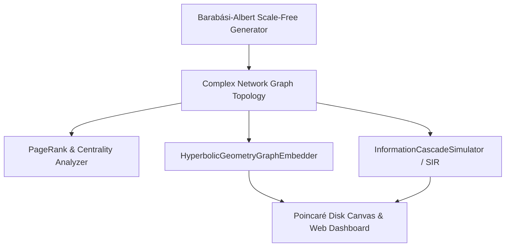

# Autonomous Complex Network & Percolation Simulator 🌐 🧬

<div align="center">

[](https://opensource.org/licenses/MIT)
[](https://www.typescriptlang.org/)
[](https://en.wikipedia.org/wiki/Complex_network)
[](https://github.com/anderdebona/autonomous-complex-network-simulator)
[](https://github.com/anderdebona/autonomous-complex-network-simulator/actions)

<br />

**PhD-Grade Complex Networks Simulator: Poincaré Hyperbolic Embeddings, Viral Contagion & Percolation Dynamics**

*Engineered by **[anderdebona](https://github.com/anderdebona)***

</div>

---

## 📌 Abstract & Research Goals

In statistical physics and network science, real-world systems (Internet routing, metabolic networks, autonomous mesh topologies) display **Scale-Free properties** characterized by power-law degree distributions $P(k) \sim k^{-\gamma}$.

The **`autonomous-complex-network-simulator`** implements a **Barabási–Albert Scale-Free Topology Engine**, computes **Betweenness Centrality & Modularity**, maps networks into **2D Poincaré Hyperbolic Disk Coordinates**, and simulates **Viral Information Cascades** and **SIR Epidemic Spreading**.

---

## 🔬 Mathematical Formulations

### 1. Barabási–Albert Preferential Attachment & Clustering
$$\Pi(k_i) = \frac{k_i}{\sum_{j} k_j}, \qquad C_i = \frac{2 E_i}{k_i(k_i - 1)}$$

### 2. Poincaré Disk Hyperbolic Distance ($H^2$)
$$d_H(u, v) = \operatorname{arcosh}\left( 1 + \frac{2 \|u - v\|^2}{(1 - \|u\|^2)(1 - \|v\|^2)} \right)$$

---

## 🏛️ System Architecture



---

## ⚡ What's New in v4.0.0

- 🌌 **`HyperbolicGeometryGraphEmbedder`**: Negative curvature Poincaré disk representation placing high-degree hub nodes near the origin.
- 📣 **`InformationCascadeSimulator`**: Independent cascade model (ICM) simulating viral idea dissemination and influencer reach.
- 🔍 **`PageRankEngine` & `CommunityDetector`**: Power-iteration PageRank and Girvan-Newman modularity partitioning.
- 🐙 **Automated Multi-Matrix CI/CD**: Full GitHub Actions test suites across Node LTS versions.

---

## 🚀 Quickstart & Installation

```bash
# Clone repository
git clone https://github.com/anderdebona/autonomous-complex-network-simulator.git
cd autonomous-complex-network-simulator

# Install dependencies
npm install

# Run automated tests
npm test

# Build & Run Simulator & Canvas Dashboard
npm run dev
```

Visit the interactive visual dashboard at: **`http://localhost:3006`**

---

## 🌟 Join the Community & Contribute

Join our community exploring the geometry of complex networks and dynamical systems:
1. ⭐ **Star this repository** to support network science research!
2. 🗺️ View our roadmap in [ROADMAP.md](./ROADMAP.md).
3. 💬 Propose new random graph models or metrics via [GitHub Issues](https://github.com/anderdebona/autonomous-complex-network-simulator/issues).
4. 📜 Academic citation: see [CITATION.cff](./CITATION.cff).

---

<div align="center">

Distributed under the MIT License. Built with passion by **[anderdebona](https://github.com/anderdebona)**.

</div>
